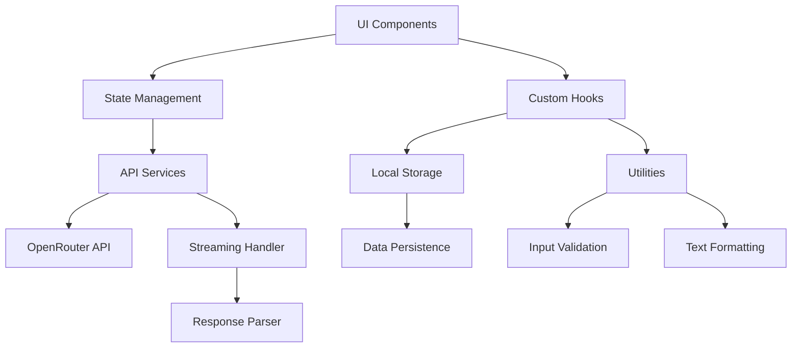

# Design Document

## Overview

This design document outlines the architecture and implementation approach for enhancing the existing React-based chat application with OpenRouter API integration, streaming responses, improved UI/UX, and advanced functionality. The design maintains the current component structure while adding new services, hooks, and utilities to support real AI conversations and enhanced user experience.

The enhanced application will transform from a mock-based chat interface to a fully functional AI-powered chat client that supports multiple models, streaming responses, conversation management, and professional-grade features.

## Architecture

### High-Level Architecture



### Core Architecture Principles

1. **Separation of Concerns**: Clear separation between UI components, business logic, and API integration
2. **Reactive Design**: Use React hooks and context for state management and real-time updates
3. **Progressive Enhancement**: Graceful degradation when features are unavailable
4. **Performance First**: Implement virtual scrolling, debouncing, and efficient re-rendering
5. **Accessibility**: Full keyboard navigation and screen reader support
6. **Error Resilience**: Comprehensive error handling and recovery mechanisms

## Components and Interfaces

### New Components

#### 1. ApiKeySetup Component
```typescript
interface ApiKeySetupProps {
  onApiKeySet: (apiKey: string) => void;
  isVisible: boolean;
  onClose: () => void;
}
```
- Modal dialog for API key configuration
- Validation and testing of API keys
- Secure storage instructions

#### 2. StreamingMessage Component
```typescript
interface StreamingMessageProps {
  content: string;
  isStreaming: boolean;
  onStreamComplete: () => void;
  onStreamError: (error: Error) => void;
}
```
- Real-time message rendering during streaming
- Cursor animation and typing indicators
- Stream interruption handling

#### 3. MessageEditor Component
```typescript
interface MessageEditorProps {
  message: Message;
  onSave: (content: string) => void;
  onCancel: () => void;
  isEditing: boolean;
}
```
- Inline message editing with rich text support
- Save/cancel functionality
- Validation and formatting

#### 4. ConversationSearch Component
```typescript
interface ConversationSearchProps {
  conversations: Conversation[];
  onSearch: (query: string) => void;
  searchResults: Conversation[];
  isSearching: boolean;
}
```
- Real-time search with debouncing
- Highlight matching text
- Advanced filtering options

#### 5. ErrorBoundary Component
```typescript
interface ErrorBoundaryProps {
  children: React.ReactNode;
  fallback: React.ComponentType<{ error: Error; retry: () => void }>;
  onError: (error: Error) => void;
}
```
- Global error handling
- Recovery mechanisms
- Error reporting

### Enhanced Existing Components

#### ChatApp Component Updates
- Integration with OpenRouter service
- Streaming state management
- Enhanced error handling
- Performance optimizations

#### ChatMessages Component Updates
- Virtual scrolling implementation
- Streaming message support
- Enhanced message actions
- Improved accessibility

#### SettingsPanel Component Updates
- API key management section
- Model-specific parameters
- Advanced configuration options
- Import/export functionality

#### ChatInput Component Updates
- Rich text formatting
- File upload support
- Voice input integration
- Token counting and validation

## Data Models

### Enhanced Message Interface
```typescript
interface Message {
  id: string;
  content: string;
  role: 'user' | 'assistant' | 'system';
  timestamp: Date;
  isStreaming?: boolean;
  isEdited?: boolean;
  editHistory?: MessageEdit[];
  rating?: 'up' | 'down';
  tokens?: number;
  model?: string;
  error?: string;
  attachments?: Attachment[];
}

interface MessageEdit {
  id: string;
  previousContent: string;
  timestamp: Date;
  reason?: string;
}

interface Attachment {
  id: string;
  type: 'file' | 'image' | 'audio';
  name: string;
  size: number;
  url: string;
  mimeType: string;
}
```

### OpenRouter Configuration
```typescript
interface OpenRouterConfig {
  apiKey: string;
  baseUrl: string;
  defaultModel: string;
  timeout: number;
  retryAttempts: number;
  streamingEnabled: boolean;
}

interface ModelInfo {
  id: string;
  name: string;
  description: string;
  contextLength: number;
  pricing: {
    prompt: number;
    completion: number;
  };
  capabilities: string[];
  provider: string;
}
```

### Enhanced Settings Interface
```typescript
interface ChatSettings {
  // API Configuration
  openRouter: OpenRouterConfig;
  
  // Model Settings
  model: string;
  temperature: number;
  maxTokens: number;
  topP: number;
  frequencyPenalty: number;
  presencePenalty: number;
  
  // UI Settings
  theme: 'light' | 'dark' | 'system';
  fontSize: number;
  language: string;
  sidebarWidth: number;
  messageSpacing: number;
  
  // Feature Settings
  streamingEnabled: boolean;
  autoSave: boolean;
  soundEnabled: boolean;
  notificationsEnabled: boolean;
  
  // System Settings
  systemPrompt: string;
  conversationHistory: number;
  autoTitle: boolean;
  
  // Advanced Settings
  debugMode: boolean;
  experimentalFeatures: boolean;
}
```

### Conversation Management
```typescript
interface Conversation {
  id: string;
  title: string;
  messages: Message[];
  createdAt: Date;
  updatedAt: Date;
  model: string;
  settings: Partial<ChatSettings>;
  tags: string[];
  isArchived: boolean;
  tokenCount: number;
  messageCount: number;
}

interface ConversationMetadata {
  totalConversations: number;
  totalMessages: number;
  totalTokens: number;
  favoriteModels: string[];
  averageResponseTime: number;
}
```

## API Integration

### OpenRouter Service
```typescript
class OpenRouterService {
  private config: OpenRouterConfig;
  private abortController?: AbortController;
  
  constructor(config: OpenRouterConfig);
  
  async sendMessage(
    messages: Message[],
    options: {
      model: string;
      stream?: boolean;
      temperature?: number;
      maxTokens?: number;
    }
  ): Promise<Message | AsyncIterable<string>>;
  
  async getModels(): Promise<ModelInfo[]>;
  async validateApiKey(apiKey: string): Promise<boolean>;
  cancelCurrentRequest(): void;
  
  private handleStreamResponse(response: Response): AsyncIterable<string>;
  private handleError(error: any): never;
}
```

### Streaming Implementation
```typescript
interface StreamingHandler {
  onToken: (token: string) => void;
  onComplete: (fullResponse: string) => void;
  onError: (error: Error) => void;
  onStart: () => void;
}

class StreamProcessor {
  private handler: StreamingHandler;
  private buffer: string = '';
  
  constructor(handler: StreamingHandler);
  
  processChunk(chunk: string): void;
  complete(): void;
  error(error: Error): void;
  
  private parseSSEChunk(chunk: string): string | null;
  private extractContent(data: any): string;
}
```

## Error Handling

### Error Types and Handling Strategy

```typescript
enum ErrorType {
  NETWORK_ERROR = 'NETWORK_ERROR',
  API_KEY_INVALID = 'API_KEY_INVALID',
  RATE_LIMIT_EXCEEDED = 'RATE_LIMIT_EXCEEDED',
  MODEL_UNAVAILABLE = 'MODEL_UNAVAILABLE',
  STREAMING_ERROR = 'STREAMING_ERROR',
  VALIDATION_ERROR = 'VALIDATION_ERROR',
  STORAGE_ERROR = 'STORAGE_ERROR'
}

interface ChatError {
  type: ErrorType;
  message: string;
  details?: any;
  timestamp: Date;
  recoverable: boolean;
  retryAfter?: number;
}

class ErrorHandler {
  static handle(error: ChatError): {
    userMessage: string;
    action: 'retry' | 'configure' | 'wait' | 'report';
    retryDelay?: number;
  };
  
  static isRecoverable(error: ChatError): boolean;
  static shouldRetry(error: ChatError, attemptCount: number): boolean;
}
```

### Error Recovery Mechanisms

1. **Automatic Retry**: For transient network errors with exponential backoff
2. **Graceful Degradation**: Fall back to non-streaming mode when streaming fails
3. **User Guidance**: Clear error messages with actionable steps
4. **State Recovery**: Preserve user input and conversation state during errors
5. **Offline Support**: Queue messages when network is unavailable

## Testing Strategy

### Unit Testing
- Component rendering and interaction tests
- Service layer functionality tests
- Utility function validation tests
- Error handling scenario tests

### Integration Testing
- API integration with mock OpenRouter responses
- Streaming functionality end-to-end tests
- Settings persistence and restoration tests
- Conversation management workflow tests

### Performance Testing
- Virtual scrolling performance with large datasets
- Memory usage monitoring during long conversations
- Streaming response handling under various network conditions
- UI responsiveness during intensive operations

### Accessibility Testing
- Keyboard navigation flow validation
- Screen reader compatibility testing
- Color contrast and visual accessibility checks
- Focus management and ARIA label verification

## Performance Optimizations

### Virtual Scrolling Implementation
```typescript
interface VirtualScrollConfig {
  itemHeight: number;
  containerHeight: number;
  overscan: number;
  threshold: number;
}

class VirtualScrollManager {
  private config: VirtualScrollConfig;
  private visibleRange: { start: number; end: number };
  
  calculateVisibleItems(scrollTop: number, totalItems: number): {
    startIndex: number;
    endIndex: number;
    offsetY: number;
  };
  
  getItemStyle(index: number): React.CSSProperties;
  shouldUpdate(newScrollTop: number): boolean;
}
```

### Memory Management
- Implement conversation cleanup for old messages
- Use React.memo for expensive components
- Debounce user input and search operations
- Lazy load conversation history

### Caching Strategy
- Cache API responses for model information
- Store conversation metadata separately from messages
- Implement LRU cache for frequently accessed conversations
- Use service worker for offline caching

## Security Considerations

### API Key Management
- Store API keys in encrypted local storage
- Never expose API keys in client-side code
- Implement key rotation mechanisms
- Provide clear security guidelines to users

### Data Protection
- Encrypt sensitive conversation data
- Implement data retention policies
- Provide data export and deletion options
- Ensure GDPR compliance for EU users

### Input Validation
- Sanitize all user inputs
- Validate file uploads and attachments
- Implement rate limiting for API calls
- Prevent XSS and injection attacks

## Deployment and Build Considerations

### Build Optimizations
- Code splitting for better loading performance
- Tree shaking to reduce bundle size
- Asset optimization and compression
- Progressive web app capabilities

### Environment Configuration
- Separate development and production configurations
- Environment-specific API endpoints
- Feature flags for experimental functionality
- Monitoring and analytics integration

### Browser Compatibility
- Support for modern browsers (Chrome 90+, Firefox 88+, Safari 14+)
- Polyfills for missing features
- Graceful degradation for older browsers
- Mobile browser optimization

## Migration Strategy

### Phase 1: Core Infrastructure
- Implement OpenRouter service integration
- Add basic streaming support
- Update existing components for new data models
- Implement error handling framework

### Phase 2: Enhanced Features
- Add conversation management improvements
- Implement message editing and management
- Enhance settings panel with new options
- Add file upload and attachment support

### Phase 3: Performance and Polish
- Implement virtual scrolling
- Add accessibility improvements
- Optimize performance and memory usage
- Add comprehensive testing coverage

### Phase 4: Advanced Features
- Voice input and transcription
- Advanced search and filtering
- Export/import functionality
- Analytics and usage tracking

This design provides a comprehensive foundation for transforming the existing chat application into a professional-grade AI chat interface with robust functionality, excellent user experience, and maintainable architecture.